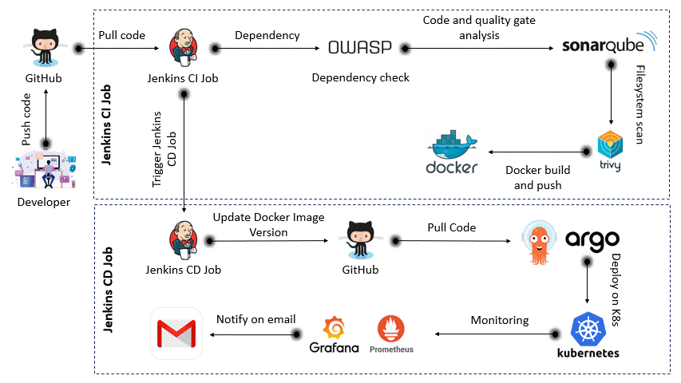

# Wanderlust - Your Ultimate Travel Blog 🌍✈️

Wanderlust is a full-fledged MERN stack travel blogging platform, deployed securely and scalably using modern DevSecOps practices. This project is designed to not only demonstrate a working React-based application but also showcase an end-to-end deployment pipeline using CI/CD, Kubernetes, container scanning, quality checks, and monitoring on AWS EKS.

🔧 Tech Stack
💻 Application Stack (MERN):
MongoDB – Database

Express.js – Backend API

React.js – Frontend

Node.js – Runtime Environment

🚀 DevSecOps Tools:
GitHub – Source Control

Docker – Containerization

Jenkins – CI Pipelines

OWASP Dependency-Check – Vulnerability Scanning

SonarQube – Code Quality & Static Analysis

Trivy – Container Image and Filesystem Security

ArgoCD – GitOps-based CD for Kubernetes

Redis – Caching Layer

AWS EKS – Kubernetes Cluster

Helm – Deployment & Monitoring via Prometheus and Grafana

📦 CI/CD Pipeline Architecture
CI Pipeline
Builds and pushes Docker images

Runs OWASP & Trivy scans

Performs static code analysis via SonarQube

Publishes test results and image metadata

CD Pipeline
Uses ArgoCD for continuous delivery to EKS

Updates application versions automatically using GitOps

Sends email notifications upon build/deploy success/failure

Monitoring & Alerts
Prometheus scrapes metrics from Kubernetes cluster

Grafana dashboards visualize performance and health

📸 DevSecOps Pipeline Snapshots
CI/CD Stages	Previews
CI Pipeline	
CD Pipeline	
ArgoCD Dashboard	

Project Highlights

DevSecOps End-to-End Flow: From build to monitor

Production-Ready Kubernetes Deployment: Resilient and scalable setup on AWS EKS

Developer Best Practices: Git branching, reusable Jenkinsfiles, and pipeline libraries

Security First: Integrated scanning and image compliance checks before deployment

Observability: Real-time cluster health metrics and alerting

🧹 Cleanup
To delete all EKS resources:

eksctl delete cluster --name=wanderlust --region=us-west-1

🤝 Credits & Contributions
Inspired by the amazing open-source community and DevOps tutorials.
Built and maintained with ❤️ by Mansirat

📩 Let's Connect!
📧 Email: siratvirk99@gmail.com
💼 LinkedIn: https://www.linkedin.com/in/mansirat-virk-devops/

